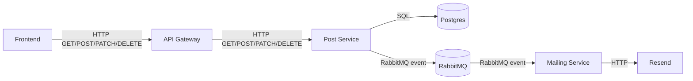
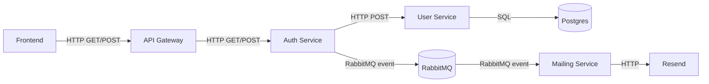
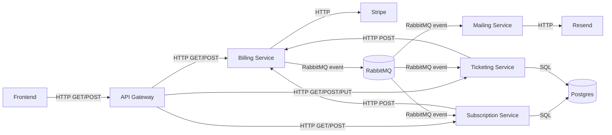
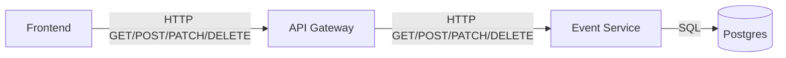
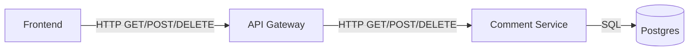

# Event Thunder - Guide de mise en production

## Presentation du projet

Event Thunder est une plateforme de gestion d'evenements avec billetterie, abonnements et publication de contenus. L'architecture est composee de microservices NestJS, d'un frontend React/Vite, d'une base Postgres (via Prisma) et d'un bus d'evenements RabbitMQ. Les paiements passent par Stripe, l'authentification peut utiliser Google OAuth, et les emails sont envoyes via Resend.

## Services

- api-gateway: point d'entree unique qui proxifie les routes /api, applique l'authentification JWT, gere les routes publiques/optionnelles, et injecte x-user-id/x-user-role.
- auth-service: inscription/connexion, verification JWT, Google OAuth, reset password, publication d'evenements mail.
- user-service: gestion des profils, mots de passe, roles, et operations admin sur les utilisateurs.
- event-service: CRUD des evenements et gestion des categories, avec liste publique.
- comment-service: commentaires par evenement, likes, comptage, suppression admin.
- post-service: gestion des posts reseaux, generation de texte IA, confirmations de publication, dispatch cron, publication d'evenements mail.
- subscription-service: plans, checkout, resume/cancel, factures, et consommation des evenements de billing.
- billing-service: integration Stripe (checkout, webhooks, prix), gestion des remboursements, publication d'evenements de paiement.
- ticketing-service: types de tickets par evenement, achats, factures, remboursements, consommation des evenements de billing.
- mailing-service: envoi d'emails (welcome, reset, abonnement, tickets, confirmation post) via Resend, consommation RabbitMQ.
- frontend: application React/Vite consommatrice de l'API Gateway.

## Schemas d'architecture par domaine

### Posts (reseaux et confirmations)



### Authentification



### Paiements (abonnements et tickets)



### Evenements



### Commentaires



## Schema base de donnees (Prisma)

```mermaid
erDiagram
  Comment {
    UUID id PK
    UUID user_id INDEX
    UUID event_id INDEX
    TEXT content
    TIMESTAMP created_at
    TIMESTAMP updated_at
  }

  CommentLike {
    UUID id PK
    UUID user_id INDEX
    UUID comment_id FK
    TIMESTAMP created_at
  }

  Category {
    UUID id PK
    VARCHAR name
    TIMESTAMP created_at
    TIMESTAMP updated_at
  }

  Event {
    UUID id PK
    UUID creator_id INDEX
    VARCHAR title
    TEXT description
    UUID category_id FK
    VARCHAR location
    TEXT address
    TIMESTAMP start_date
    TIMESTAMP end_date
    VARCHAR image_url
    EventStatus status
    TIMESTAMP created_at
    TIMESTAMP updated_at
  }

  Post {
    UUID id PK
    UUID event_id NULL INDEX
    UUID user_id INDEX
    TEXT content
    PostStatus status
    TIMESTAMP scheduled_at NULL
    TIMESTAMP published_at NULL
    TIMESTAMP created_at
    TIMESTAMP updated_at
  }

  PostTarget {
    UUID id PK
    UUID post_id FK
    SocialNetwork network
    PostTargetStatus status
    VARCHAR(255) external_post_id NULL
    VARCHAR(255) error_message NULL
    TIMESTAMP created_at
    TIMESTAMP published_at NULL
  }

  PostReminder {
    UUID id PK
    UUID post_id FK
    TIMESTAMP reminder_at
    VARCHAR(255) message NULL
    PostReminderStatus status
    TIMESTAMP created_at
    TIMESTAMP sent_at NULL
  }

  PostConfirmationToken {
    UUID id PK
    UUID post_id FK
    VARCHAR(64) token_hash UNIQUE
    TIMESTAMP expires_at
    TIMESTAMP consumed_at NULL
    TIMESTAMP created_at
  }

  User {
    UUID id PK
    VARCHAR email UNIQUE
    VARCHAR password
    UserRole role
    VARCHAR stripe_customer_id NULL UNIQUE
  }

  UsersInfo {
    UUID id PK
    UUID user_id FK UNIQUE
    VARCHAR(50) first_name NULL
    VARCHAR(50) last_name NULL
    VARCHAR(30) phone_number NULL
  }

  Plan {
    UUID id PK
    VARCHAR(100) name
    DECIMAL(10,2) price
    PlanInterval interval
    PlanCurrency currency
    VARCHAR stripe_price_id UNIQUE
    INT max_events
    INT max_posts
    INT display_order
    TEXT description NULL
    TIMESTAMP created_at
  }

  Subscription {
    UUID id PK
    UUID user_id
    UUID plan_id FK
    VARCHAR stripe_subscription_id UNIQUE
    SubscriptionStatus status
    TIMESTAMP current_period_start NULL
    TIMESTAMP current_period_end NULL
    TIMESTAMP canceled_at NULL
    TIMESTAMP ended_at NULL
    TIMESTAMP created_at
    TIMESTAMP updated_at
  }

  PaymentSubHistory {
    UUID id PK
    UUID subscription_id FK
    VARCHAR stripe_invoice_id UNIQUE
    DECIMAL(10,2) amount
    PaymentCurrency currency
    PaymentStatus status
    TIMESTAMP paid_at NULL
    TIMESTAMP created_at
  }

  TicketType {
    UUID id PK
    UUID event_id INDEX
    VARCHAR(120) name
    TEXT description NULL
    DECIMAL(10,2) price
    TicketCurrency currency
    INT max_quantity NULL
    INT sold_quantity
    BOOLEAN is_active
    TIMESTAMP created_at
    TIMESTAMP updated_at
  }

  TicketPurchase {
    UUID id PK
    UUID user_id INDEX
    VARCHAR stripe_payment_intent_id UNIQUE
    TicketPurchaseStatus status
    DECIMAL(10,2) total_amount
    TicketCurrency currency
    TIMESTAMP paid_at NULL
    TIMESTAMP failed_at NULL
    TIMESTAMP refunded_at NULL
    TIMESTAMP cancelled_at NULL
    VARCHAR(255) failure_reason NULL
    TIMESTAMP created_at
    TIMESTAMP updated_at
  }

  TicketPurchaseItem {
    UUID id PK
    UUID ticket_purchase_id FK
    UUID ticket_type_id FK
    INT quantity
    DECIMAL(10,2) unit_price
    TicketCurrency currency
    VARCHAR(120) ticket_type_label NULL
    TIMESTAMP created_at
  }

  Ticket {
    UUID id PK
    UUID ticket_purchase_id FK
    UUID ticket_type_id FK
    VARCHAR attendee_firstname
    VARCHAR attendee_lastname
    VARCHAR attendee_email NULL
    VARCHAR ticket_number UNIQUE
    TEXT qr_code
    BOOLEAN used
    TIMESTAMP used_at NULL
    TIMESTAMP created_at
    TIMESTAMP updated_at
  }

  EventStatus {
    ENUM draft
    ENUM published
    ENUM canceled
    ENUM completed
  }

  PostStatus {
    ENUM draft
    ENUM scheduled
    ENUM awaiting_confirmation
    ENUM expired
    ENUM published
    ENUM archived
  }

  SocialNetwork {
    ENUM x
    ENUM facebook
  }

  PostTargetStatus {
    ENUM pending
    ENUM published
    ENUM failed
    ENUM cancelled
  }

  PostReminderStatus {
    ENUM pending
    ENUM sent
    ENUM cancelled
  }

  UserRole {
    ENUM User
    ENUM Admin
  }

  PlanInterval {
    ENUM monthly
    ENUM yearly
  }

  PlanCurrency {
    ENUM EUR
    ENUM USD
  }

  SubscriptionStatus {
    ENUM active
    ENUM canceled
  }

  PaymentStatus {
    ENUM paid
    ENUM failed
  }

  PaymentCurrency {
    ENUM EUR
    ENUM USD
  }

  TicketPurchaseStatus {
    ENUM pending
    ENUM paid
    ENUM failed
    ENUM refunded
    ENUM cancelled
  }

  TicketCurrency {
    ENUM EUR
    ENUM USD
  }

  Comment ||--o{ CommentLike : has
  Category ||--o{ Event : has
  Post ||--o{ PostTarget : has
  Post ||--o{ PostReminder : has
  Post ||--o{ PostConfirmationToken : has
  User ||--|| UsersInfo : has
  Plan ||--o{ Subscription : has
  Subscription ||--o{ PaymentSubHistory : has
  TicketType ||--o{ TicketPurchaseItem : has
  TicketPurchase ||--o{ TicketPurchaseItem : has
  TicketType ||--o{ Ticket : has
  TicketPurchase ||--o{ Ticket : has

  Comment }o--|| User : "logical user_id"
  Comment }o--|| Event : "logical event_id"
  CommentLike }o--|| User : "logical user_id"
  Post }o--|| User : "logical user_id"
  Post }o--|| Event : "logical event_id"
  TicketType }o--|| Event : "logical event_id"
  TicketPurchase }o--|| User : "logical user_id"
  Subscription }o--|| User : "logical user_id"
```

Note: Les relations "logical" representent des liens inter-services (pas de FK physiques entre bases).

## Endpoints principaux (via API Gateway)

- **Auth**: `GET /api/auth/google/url`, `GET /api/auth/google/callback`, `POST /api/auth/google/callback`, `POST /api/auth/register`, `POST /api/auth/login`, `GET /api/auth/verify`, `POST /api/auth/forgot-password`, `GET /api/auth/verify-reset-token`, `POST /api/auth/reset-password`, `POST /api/auth/logout`, `GET /api/auth/health`.
- **Users**: `POST /api/users`, `POST /api/users/verify`, `GET /api/users/:id`, `GET /api/users/email/:email`, `PATCH /api/users/password`, `PUT /api/users/password`, `PUT /api/users/profile`, `GET /api/users`, `DELETE /api/users/:id`, `PATCH /api/users/role`, `GET /api/users/health`.
- **Events**: `GET /api/events`, `GET /api/events/public`, `GET /api/events/:id`, `POST /api/events`, `PATCH /api/events/:id`, `DELETE /api/events/:id`.
- **Categories**: `GET /api/events/categories`, `POST /api/events/categories`, `PATCH /api/events/categories/:id`, `DELETE /api/events/categories/:id`.
- **Comments**: `GET /api/comments/events/:eventId`, `GET /api/comments/events/:eventId/count`, `POST /api/comments/events/:eventId`, `POST /api/comments/:commentId/likes/toggle`, `DELETE /api/comments/:commentId`.
- **Posts**: `GET /api/posts/public`, `GET /api/posts`, `GET /api/posts/admin`, `GET /api/posts/:id`, `POST /api/posts`, `POST /api/posts/generate-text`, `PATCH /api/posts/:id`, `DELETE /api/posts/:id`, `POST /api/posts/:id/confirm`, `POST /api/posts/:id/publish-manual`, `POST /api/posts/:id/cancel-manual`, `POST /api/posts/internal/dispatch-due`.
- **Subscriptions**: `GET /api/subscriptions/plans`, `POST /api/subscriptions/plans`, `PATCH /api/subscriptions/plans/:id`, `DELETE /api/subscriptions/plans/:id`, `POST /api/subscriptions/checkout-session`, `POST /api/subscriptions/cancel`, `POST /api/subscriptions/resume`, `POST /api/subscriptions/finalize-plan-change`, `GET /api/subscriptions/user/:userId`, `GET /api/subscriptions/admin/overview`, `GET /api/subscriptions/invoices/:stripeInvoiceId`.
- **Billing**: `POST /api/billing/subscriptions/checkout-session`, `POST /api/billing/tickets/checkout-session`, `POST /api/billing/tickets/refund`, `POST /api/billing/subscriptions/cancel`, `POST /api/billing/subscriptions/resume`, `GET /api/billing/invoices/:stripeInvoiceId`, `GET /api/billing/tickets/payments/:stripePaymentIntentId/invoice-links`, `POST /api/billing/plans/sync-price`, `POST /api/billing/plans/archive-price`, `POST /api/billing/stripe/webhook`.
- **Ticketing**: `GET /api/ticketing/events/:eventId/types`, `PUT /api/ticketing/events/:eventId/types`, `GET /api/ticketing/events/:eventId/sold-tickets`, `POST /api/ticketing/checkout-session`, `GET /api/ticketing/me/tickets`, `GET /api/ticketing/admin/tickets`, `GET /api/ticketing/payments/:stripePaymentIntentId/invoice-links`, `GET /api/ticketing/internal/purchases/payment-intent/:stripePaymentIntentId`, `POST /api/ticketing/purchases/:purchaseId/refund`.


Ce document decrit une mise en prod sur un serveur sans ports publics ouverts, avec Nginx en local et Cloudflare Tunnel pour l'exposition externe.

## 1) Architecture cible

- Docker Compose lance tous les services en local sur le serveur.
- Nginx sert le frontend et reverse-proxy les routes API.
- Cloudflare Tunnel expose seulement Nginx (et eventuellement un tunnel dedie Stripe si voulu).

## 2) Pre-requis serveur

- Docker + Docker Compose installes
- Node.js + npm installes (necessaires pour migrations Prisma via script)
- Nginx installe
- cloudflared installe
- DNS Cloudflare configure

## 3) Fichiers a configurer avant demarrage

### 3.1 .env racine

Copier et adapter le fichier .env a la racine.
  ```
    # =============================================
    # CONFIGURATION MICROSERVICES - .env (PROD)
    # =============================================

    # Postgres
    POSTGRES_HOST=postgres
    POSTGRES_PORT=5433

    # DATABASE NAME
    USER_DATABASE=event_thunder_users
    EVENT_DATABASE=event_thunder_events
    SUBSCRIPTION_DATABASE=event_thunder_subscribe
    TICKETING_DATABASE=event_thunder_ticketing
    COMMENT_DATABASE=event_thunder_comments
    POST_DATABASE=event_thunder_posts

    # Services Ports
    API_GATEWAY_PORT=8000
    BILLING_SERVICE_PORT=3006
    FRONTEND_PORT=5173

    # URLs des Services (interne Docker)
    AUTH_SERVICE_URL=http://auth-service:3000
    USER_SERVICE_URL=http://user-service:3000
    BILLING_SERVICE_URL=http://billing-service:3000
    SUBSCRIPTION_SERVICE_URL=http://subscription-service:3000
    MAILING_SERVICE_URL=http://mailing-service:3000
    EVENT_SERVICE_URL=http://event-service:3000
    COMMENT_SERVICE_URL=http://comment-service:3000
    POST_SERVICE_URL=http://post-service:3000
    TICKETING_SERVICE_URL=http://ticketing-service:3000

    # URLs publiques
    API_GATEWAY_URL=https://TON_DOMAINE
    FRONTEND_URL=https://TON_DOMAINE

    # JWT
    JWT_EXPIRES_IN=4h

    # Bcrypt
    BCRYPT_SALT_ROUNDS=10

    # Environment
    NODE_ENV=production

    # Google OAuth2 Configuration
    GOOGLE_CLIENT_ID=xxx.apps.googleusercontent.com
    GOOGLE_REDIRECT_URI=https://TON_DOMAINE/api/auth/google/callback

    # Resend Email Configuration
    MAIL_FROM=no-reply@mail.TON_DOMAINE.fr
    PRODUCT_NAME=Event Thunder

    # IA backend directe (post-service) - Groq
    AI_API_URL=https://api.groq.com/openai/v1/chat/completions
    AI_MODEL=llama-3.1-8b-instant
  ```

  ```
    sudo chown user:user /var/www/html/Event_Thunder/.env
  ```

### 3.2 Secrets Docker

Les fichiers suivants doivent exister dans le dossier secrets:

- secrets/postgres_user.txt
- secrets/postgres_password.txt
- secrets/jwt_secret.txt
- secrets/reset_password_jwt_secret.txt
- secrets/google_client_secret.txt
- secrets/stripe_secret_key.txt
- secrets/stripe_webhook_secret.txt
- secrets/resend_api_key.txt
- secrets/post_cron_secret.txt
- secrets/ai_api_key.txt
- secrets/rabbitmq_default_user.txt
- secrets/rabbitmq_default_pass.txt
- secrets/rabbitmq_url.txt

postgres_user.txt et postgres_password.txt sont utilises pour la configuration de la base de donnees Postgres.

jwt_secret.txt et reset_password_jwt_secret.txt sont utilises pour la generation de tokens JWT.

google_client_secret.txt est utilise pour l'authentification Google OAuth2.

stripe_secret_key.txt et stripe_webhook_secret.txt sont utilises pour la configuration Stripe.

resend_api_key.txt est utilise pour la configuration de Resend (service d'email).

post_cron_secret.txt est utilise pour securiser l'endpoint de dispatch des posts reseaux.

ai_api_key.txt est utilise pour la configuration de l'IA (Groq).

rabbitmq_default_user.txt, rabbitmq_default_pass.txt et rabbitmq_url.txt sont utilises pour la configuration de RabbitMQ.

  ```
    sudo chown -R user:user secrets
    chmod 700 secrets
    chmod 600 secrets/*.txt
  ```

### 3.3 Deploiement GitHub Actions via Tailscale

Si le serveur n'expose pas SSH publiquement, le CD GitHub Actions peut passer par Tailscale.

Secrets GitHub a ajouter:

- TS_OAUTH_CLIENT_ID
- TS_OAUTH_SECRET
- TS_TAILNET_HOST
- TS_SSH_USER

Valeurs attendues:

- TS_TAILNET_HOST: nom MagicDNS ou IP Tailscale du serveur
- TS_SSH_USER: utilisateur Linux pour le deploiement (ex: ubuntu)

Configuration serveur requise:

- Tailscale installe et connecte sur le nouveau serveur
- Tailscale SSH active sur le serveur:
  ```
    sudo tailscale set --ssh=true
  ```
- Une regle SSH Tailscale doit autoriser le tag GitHub Actions (ex: tag:ci) a se connecter au serveur

Exemple de principe cote Tailscale:

- le runner GitHub rejoint le tailnet avec le tag `tag:ci`
- le workflow se connecte au serveur avec `tailscale ssh`
- aucun port SSH public n'a besoin d'etre ouvert

## 4) Demarrage propre (obligatoire)

Utiliser le script fourni (migrations + build + startup): (attention il faut npm i dans chaque service pour que les migrations Prisma fonctionnent)

  ```
    chmod +x scripts/start-clean-prisma.sh
    ./scripts/start-clean-prisma.sh
  ```

Ce script:

- demarre postgres/rabbitmq
- attend postgres healthy
- applique les migrations Prisma (user, subscription, event, comment, ticketing, post)
- build et demarre toute la stack Docker

## 5) Stripe webhook (port 3006)

Endpoint webhook Stripe du projet:

- /api/billing/stripe/webhook

### Option A : via domaine principal (Nginx/API Gateway)

URL webhook Stripe:

- https://TON_DOMAINE/api/billing/stripe/webhook

### Option B: tunnel dedie vers billing-service:3006

Si vous gardez un tunnel direct 3006, URL webhook Stripe:

- https://TON_TUNNEL_3006/api/billing/stripe/webhook

Exemple local/test:

- ngrok http 3006
- URL Stripe = https://XXXX.ngrok-free.app/api/billing/stripe/webhook

Important:

- Le endpoint attend la signature Stripe (header stripe-signature)
- STRIPE_WEBHOOK_SECRET doit correspondre au endpoint configure dans Stripe

## 6) Nginx (reverse proxy local)

Objectif:

- frontend -> container frontend (port local FRONTEND_PORT)
- /api -> api-gateway (port local API_GATEWAY_PORT)

Exemple de logique:

- location / -> http://127.0.0.1:5173
- location /api/ -> http://127.0.0.1:8000

Adaptez aux ports reels de votre .env.

## 7) Cloudflare Tunnel

Exposer uniquement Nginx (sans ouvrir de ports publics serveur).

Exemple ingress cloudflared:

- host app: service http://127.0.0.1:80
- host api: service http://127.0.0.1:80 (routes /api gerees par Nginx)
- host webhook stripe (optionnel): service http://127.0.0.1:3006

Avec cette approche, le firewall peut rester strict sur les entrees publiques.

## 8) Cron Linux (posts reseaux + logs)

Le dispatch des confirmations de posts reseaux se fait via endpoint interne:

- POST /api/posts/internal/dispatch-due
- Header requis: x-cron-secret

Ajouter une crontab (ex: toutes les 1 minute) :

  ```
    * * * * * cd /chemin/Event_Thunder && /usr/bin/curl -fsS -X POST "https://TON_DOMAINE/api/posts/internal/ dispatch-due" -H "x-cron-secret:$(cat secrets/post_cron_secret.txt)" >> logs/post-cron.log 2>&1
  ```

Verifier que le dossier /logs existe (deja present dans le repo) et que l'utilisateur cron a les droits d'ecriture.
